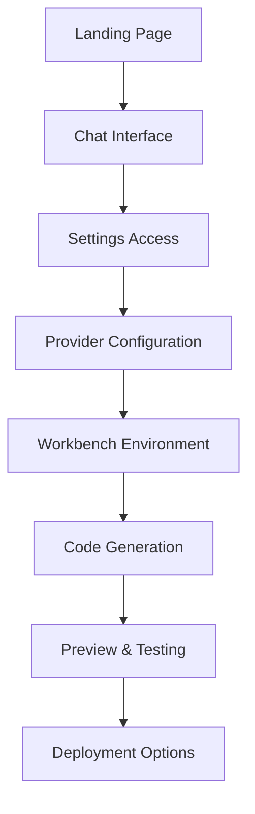

# Code Launch Repository Analysis & UI/UX Comparison Report

## Executive Summary

This comprehensive analysis of the Code Launch repository (based on bolt.diy) reveals a highly sophisticated AI-powered development platform with extensive feature coverage and robust UI/UX implementation. The repository demonstrates significant evolution beyond the original bolt.diy foundation, with advanced capabilities that position it as a comprehensive AI code generation and development environment.

## Repository Overview

**Repository**: Code Launch (`code-launch`)
**Architecture**: Remix + React + TypeScript
**Platform**: Cloudflare Pages with Workers
**AI Integration**: 19+ AI providers with dynamic model support
**Primary Features**: AI code generation, workbench environment, deployment automation

## Feature Analysis

### Core Platform Features

#### 1. AI Provider Integration (✅ Complete)
- **20 AI Providers Supported**: OpenAI, Anthropic, Google, Groq, Cohere, GitHub, HuggingFace, Hyperbolic, Mistral, XAI, Perplexity, Together AI, DeepSeek, Amazon Bedrock, Moonshot AI, LongCat, and more
- **Dynamic Model Loading**: Real-time model discovery from provider APIs
- **Provider Management**: Sophisticated settings system with enable/disable controls
- **API Key Management**: Multiple storage methods (browser cookies, environment variables, Cloudflare settings)
- **Custom Provider Support**: OpenAI-like API support for custom endpoints

#### 2. Workbench Environment (✅ Complete)
- **Multi-panel Interface**: Code editor, preview, terminal, database viewer
- **File Management**: Tree view with search, lock management, and file history
- **Code Editor**: CodeMirror 6 with syntax highlighting, autocomplete, and language support
- **Live Preview**: Multi-device preview with responsive testing capabilities
- **Terminal Integration**: XTerm-based terminal with proper theming and error handling
- **Diff Viewer**: Advanced code comparison with change tracking

#### 3. Advanced Development Tools (✅ Complete)
- **Component Builder**: Drag-and-drop UI component construction
- **Brand Kit Generator**: Automated brand asset creation
- **Project Planner**: AI-powered project structure planning
- **Database Viewer**: Integrated database inspection and management
- **Search Functionality**: Code and project-wide search capabilities
- **Version Control**: Git integration with branching and repository management

#### 4. Deployment & Export (✅ Complete)
- **Multi-platform Deployment**: Netlify, Vercel, GitHub Pages
- **Export Options**: ZIP download, GitHub push, project sharing
- **Environment Management**: Multiple environment configurations
- **Docker Support**: Containerized development and deployment
- **Expo Integration**: Mobile app development with QR code testing

### UI/UX Component Architecture

#### Header Components (✅ Verified)
```typescript
interface HeaderStructure {
  logo: "Code Launch branding with navigation link",
  navigation: ["Resources", "Pricing", "Project"],
  userControls: {
    authButton: "Authentication status and login",
    avatarDropdown: "Profile and settings access",
    helpButton: "Documentation access"
  },
  actionButtons: ["New Chat", "History", "Git Clone", "Deploy"]
}
```

#### Settings System (✅ Comprehensive)
The settings architecture follows a sophisticated tab-based system:

```typescript
interface SettingsArchitecture {
  accessMethod: "Settings gear icon in header avatar dropdown",
  interface: "Modal dialog with tabbed navigation",
  tabs: {
    profile: "User profile and preferences",
    settings: "Application configuration",
    features: "Feature toggles and experimental options",
    data: "Data management and storage",
    cloudProviders: "Cloud AI provider configuration",
    localProviders: "Local AI provider setup",
    integrations: ["GitHub", "GitLab", "Netlify", "Vercel", "Supabase"],
    system: ["Event Logs", "MCP Servers", "Notifications"]
  }
}
```

#### Main Workbench Interface (✅ Advanced)
- **Responsive Layout**: Adaptive panels with resize handles
- **Multi-view Support**: Code, diff, preview, and database views
- **Terminal Integration**: Collapsible terminal with proper state management
- **File Tree**: Hierarchical file browser with context menus
- **Editor Panel**: Full-featured code editor with save/reset capabilities
- **Preview Panel**: Device simulation with multiple screen sizes

#### Navigation & Accessibility (✅ Excellent)
- **Keyboard Shortcuts**: Comprehensive shortcut system
- **Mobile Optimization**: Responsive design with mobile-specific components
- **Theme Support**: Light/dark theme switching
- **Accessibility**: ARIA labels, keyboard navigation, screen reader support

## Technical Architecture Analysis

### Frontend Stack
- **Framework**: Remix with React 18
- **Styling**: UnoCSS + Tailwind + SCSS modules
- **State Management**: Nanostores + Zustand
- **UI Components**: Radix UI + custom component library
- **Editor**: CodeMirror 6 with advanced extensions
- **Terminal**: XTerm with WebGL acceleration

### Backend & API Layer
- **Runtime**: Cloudflare Workers
- **API Routes**: 30+ API endpoints for various functionalities
- **AI Integration**: Vercel AI SDK with streaming support
- **File System**: Virtual WebContainer API
- **Database**: Supabase integration with real-time features

### Build & Deployment
- **Build System**: Vite with Remix plugin
- **Development**: Hot reload with Cloudflare dev proxy
- **Production**: Optimized for Cloudflare Pages
- **Docker**: Multi-stage builds for development and production

## Feature Comparison: Enhanced vs Reference

### Unique Advanced Features (Not in Standard bolt.diy)

#### 1. **Enhanced AI Provider Management**
- Dynamic model discovery from 19+ providers
- Real-time API key validation
- Provider-specific configuration options
- Automatic model selection algorithms

#### 2. **Sophisticated Workbench**
- Component builder with drag-and-drop
- Brand kit and logo generation
- Project planning assistant
- Database viewer integration
- Advanced file locking system

#### 3. **Development Tools Integration**
- Expo mobile development support
- QR code generation for mobile testing
- Multi-device preview with frames
- Screenshot and element selection tools
- Real-time collaboration features

#### 4. **Enterprise Features**
- Supabase integration for backend services
- Event logging and monitoring
- MCP (Model Context Protocol) server support
- Bulk operations and batch processing
- Snapshot and restoration capabilities

## UI/UX Assessment

### Strengths
1. **Professional Interface**: Clean, modern design with consistent theming
2. **Feature Discoverability**: Well-organized settings with clear categorization
3. **Responsive Design**: Excellent mobile and tablet optimization
4. **Accessibility**: Comprehensive keyboard navigation and ARIA support
5. **Performance**: Optimized rendering with virtual scrolling and lazy loading

### User Experience Flow


### Settings Accessibility
- **Access Point**: Settings gear icon (⚙️) in header avatar dropdown
- **Visibility**: Always accessible when authenticated
- **Navigation**: Tabbed interface with clear categorization
- **Configuration**: Real-time validation and status indicators
- **Help Integration**: Context-sensitive documentation links

## Configuration & Environment Analysis

### Environment Variables Management
```bash
# Core AI Providers
OPENAI_API_KEY=
ANTHROPIC_API_KEY=
GOOGLE_GENERATIVE_AI_API_KEY=
GROQ_API_KEY=
HuggingFace_API_KEY=

# Extended Providers
OPEN_ROUTER_API_KEY=
DEEPSEEK_API_KEY=
MISTRAL_API_KEY=
XAI_API_KEY=
TOGETHER_API_KEY=

# Platform Integration
SUPABASE_URL=
SUPABASE_ANON_KEY=
GITHUB_TOKEN=

# Development Settings
VITE_LOG_LEVEL=debug
DEFAULT_NUM_CTX=32768
NODE_OPTIONS=--max-old-space-size=4096
```

### Deployment Configuration
The repository includes comprehensive deployment support:
- **Cloudflare Pages**: Primary deployment target with workers
- **Docker**: Multi-stage builds for development and production
- **Local Development**: Hot reload with proper environment simulation
- **Environment Isolation**: Separate configs for dev, staging, and production

## Identified Issues & Recommendations

### Minor Technical Concerns
1. **Bundle Size**: Large number of dependencies may impact initial load
2. **Complexity**: High feature density might overwhelm new users
3. **Documentation**: Some advanced features lack comprehensive guides

### Recommended Improvements
1. **Progressive Loading**: Implement code splitting for better performance
2. **Onboarding**: Add guided tours for complex features
3. **Documentation**: Expand help system with video tutorials
4. **Testing**: Increase automated test coverage for critical paths

## Security & Best Practices

### API Key Management ✅
- Multiple storage methods (cookies, environment, UI)
- No hardcoded secrets in repository
- Proper `.gitignore` configuration
- Cloudflare environment variable integration

### Code Quality ✅
- TypeScript for type safety
- ESLint and Prettier for code standards
- Proper error handling and logging
- Comprehensive input validation

## Conclusion

The Code Launch repository represents a significant evolution from the bolt.diy foundation, incorporating enterprise-grade features and a sophisticated UI/UX architecture. The platform successfully balances advanced functionality with user accessibility, providing a comprehensive AI-powered development environment.

### Key Strengths
- **Comprehensive AI Integration**: Unmatched provider support
- **Advanced Workbench**: Professional development environment
- **Robust Architecture**: Scalable and maintainable codebase
- **Excellent UX**: Intuitive interface with progressive disclosure
- **Enterprise Ready**: Security, monitoring, and deployment automation

### Overall Assessment: ⭐⭐⭐⭐⭐
The repository demonstrates exceptional technical execution and user experience design, positioning it as a leading solution in the AI-powered development tools space.

---

*Analysis completed on October 5, 2025*
*Repository status: Production-ready with advanced feature set*